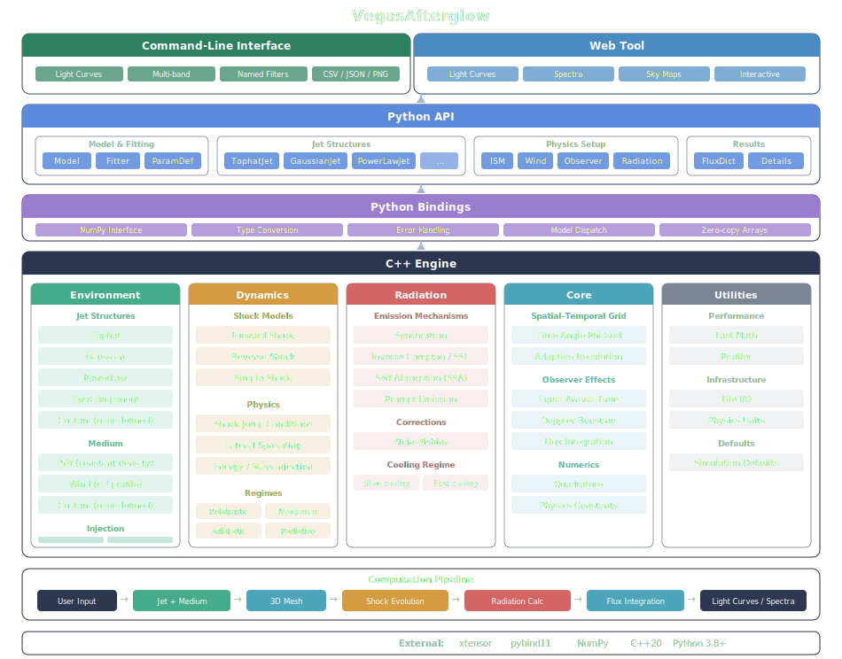
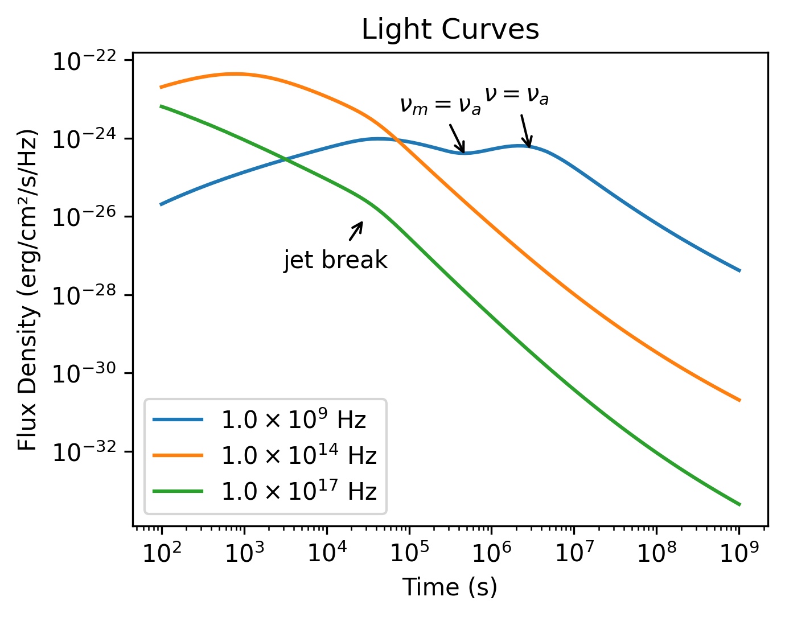
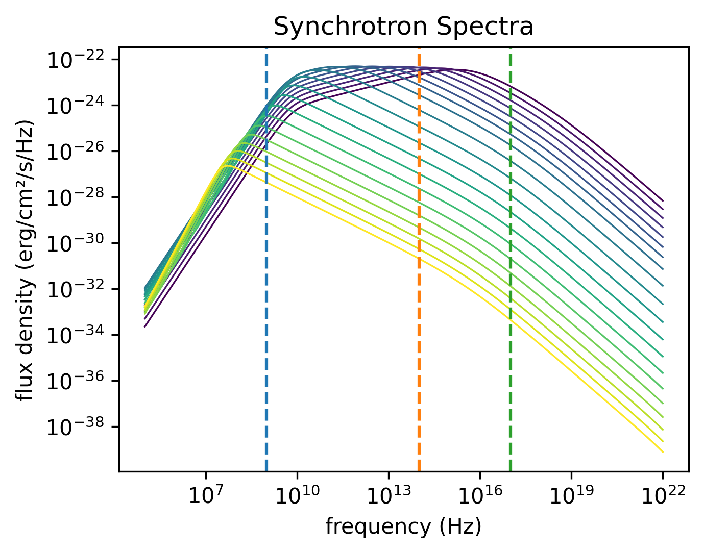
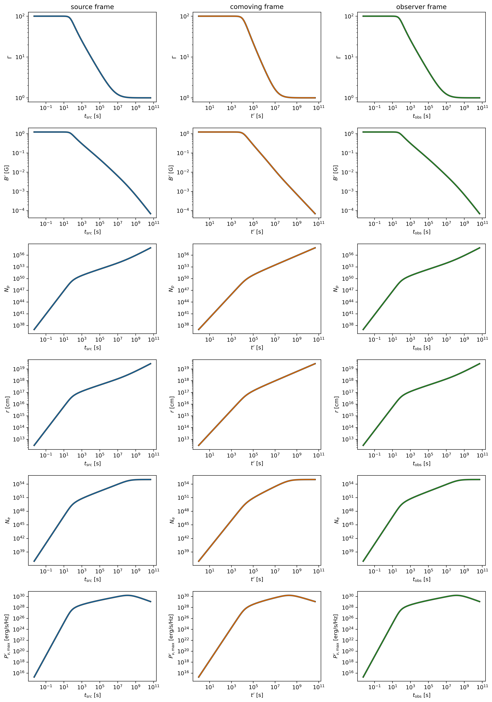

# VegasAfterglow


[](https://en.cppreference.com/w/cpp/20)
[](https://pypi.org/project/VegasAfterglow/)
[](https://github.com/YihanWangAstro/VegasAfterglow/actions/workflows/PyPI-build.yml)
[](LICENSE)
[]()
[](https://www.python.org/)
[](https://yihanwangastro.github.io/VegasAfterglow/docs/index.html)
[](https://vegasafterglow.vercel.app)
[](https://yihanwangastro.github.io/VegasAfterglow/reports/latest/comprehensive_report.pdf)

<div align="left">

**[Latest Release Notes](CHANGELOG.md#v200-beta---2026-02-02)** | **[Interactive Web Tool](https://vegasafterglow.vercel.app)** | **[Validation Report (PDF)](https://yihanwangastro.github.io/VegasAfterglow/reports/latest/comprehensive_report.pdf)** | **[Install Now](#installation)**
</div>

<p align="justify">
<b>VegasAfterglow</b> is a high-performance C++ framework with a user-friendly Python interface designed for the comprehensive modeling of Gamma-Ray Burst (GRB) afterglows. It achieves exceptional computational efficiency, enabling the generation of multi-wavelength light curves in milliseconds and facilitating robust Markov Chain Monte Carlo (MCMC) parameter inference. The framework incorporates advanced models for shock dynamics (both forward and reverse shocks), diverse radiation mechanisms (synchrotron with self-absorption, and inverse Compton scattering with Klein-Nishina corrections), and complex structured jet configurations.
</p>

<h3 align="center">Ecosystem & Integration</h3>

* **Advanced Inference:** While VegasAfterglow includes a standalone fitter, its models are also integrated into [**Redback**](https://github.com/nikhil-sarin/redback) for more advanced Bayesian inference, model comparison, and multi-messenger analysis.
* **Community Tools:** We also recommend checking out [**PyFRS**](https://github.com/leiwh/PyFRS), [**Jetsimpy**](https://github.com/haowang-astro/jetsimpy), [**ASGARD**](https://github.com/mikuru1096/ASGARD_GRBAfterglow) as tool for afterglow modeling.
<br clear="left"/>

---

## Table of Contents

- [VegasAfterglow](#vegasafterglow)
  - [Table of Contents](#table-of-contents)
  - [Features](#features)
  - [Performance Highlights](#performance-highlights)
  - [Installation](#installation)
    - [Python Installation](#python-installation)
    - [C++ Installation](#c-installation)
  - [Usage](#usage)
    - [Quick Start](#quick-start)
      - [Command-Line Tool (`vegasgen`)](#command-line-tool-vegasgen)
      - [Python API](#python-api)
    - [Light Curve \& Spectrum Calculation](#light-curve--spectrum-calculation)
    - [Internal Quantities Evolution](#internal-quantities-evolution)
    - [Sky Image](#sky-image)
    - [MCMC Parameter Fitting](#mcmc-parameter-fitting)
    - [Parameter Fitting with **Redback**](#parameter-fitting-with-redback)
  - [Validation \& Testing](#validation--testing)
  - [Documentation](#documentation)
  - [Contributing](#contributing)
  - [License](#license)
  - [Acknowledgments \& Citation](#acknowledgments--citation)

---

## Features

<h3 align="center">Shock Dynamics</h3>


- **Forward and Reverse Shock Modeling:** Simulates both shocks via shock crossing dynamics with arbitrary magnetization levels and shell thicknesses.
- **Relativistic and Non-Relativistic Regimes:** Accurately models shock evolution across all velocity regimes.
- **Adiabatic and Radiative Blast Waves:** Supports smooth transition between adiabatic and radiative blast waves.
- **Ambient Medium:** Supports uniform Interstellar Medium (ISM), stellar wind environments, and **[user-defined density profiles](https://yihanwangastro.github.io/VegasAfterglow/docs/examples/models.html#user-defined-medium)**.
- **Energy and Mass Injection:** Supports user-defined profiles for continuous energy and/or mass injection into the blast wave.

<br clear="right"/>

<h3 align="center">Jet Structure & Geometry</h3>


- **Structured Jet Profiles:** Allows **[user-defined angular profiles](https://yihanwangastro.github.io/VegasAfterglow/docs/examples/models.html#user-defined-jet)** for energy distribution, initial Lorentz factor, and magnetization.
- **Arbitrary Viewing Angles:** Supports off-axis observers at any viewing angle relative to the jet axis.
- **Jet Spreading:** Includes lateral expansion dynamics for realistic jet evolution (experimental).
- **Non-Axisymmetric Jets:** Capable of modeling complex, non-axisymmetric jet structures.

<br clear="right"/>

<h3 align="center">Radiation Mechanisms</h3>


- **Synchrotron Radiation:** Calculates synchrotron emission from shocked electrons.
- **Synchrotron Self-Absorption (SSA):** Includes SSA effects, crucial at low frequencies.
- **Inverse Compton (IC) Scattering:** Models IC processes, including:
  - Synchrotron Self-Compton (SSC) from both forward and reverse shocks.
  - Pairwise IC between forward and reverse shock electron and photon populations (experimental).
  - Includes Klein-Nishina corrections for accurate synchrotron and IC emission.

<br clear="right"/>

<div align="center">

</div>

---

## Performance Highlights


A 100-point single-frequency light curve for a structured off-axis jet runs in ~1 ms on one Apple M2 core. This enables MCMC parameter estimation on a laptop:

* **Tophat jet**: 10,000 MCMC steps (320,000 likelihood evaluations), 8 parameters, 15 data points — ~15 seconds (Apple M2, 8 cores).
* **Structured jet**: same setup — ~1 minute.

<br clear="left"/>

---

## Installation

VegasAfterglow is available as a Python package with C++ source code also provided for direct use.

### Python Installation

To install VegasAfterglow using pip:

```bash
pip install VegasAfterglow
```

This installs the core physics engine. To also install MCMC fitting support:

```bash
pip install VegasAfterglow[mcmc]
```

To run the interactive web tool locally:

```bash
pip install VegasAfterglow[webapp]
streamlit run webapp/app.py
```

The web app requires Streamlit 1.52 or newer.

VegasAfterglow requires Python 3.8 or higher.

<details>
<summary><b>Alternative: Install from Source</b> <i>(click to expand/collapse)</i></summary>
<br>

For cases where pip installation is not viable or when the development version is required:

1. Clone this repository:

```bash
git clone https://github.com/YihanWangAstro/VegasAfterglow.git
```

2. Navigate to the directory and install the Python package:

```bash
cd VegasAfterglow
pip install .
```

Standard development environments typically include the necessary prerequisites (C++20 compatible compiler). For build-related issues, refer to the prerequisites section in [C++ Installation](#c-installation).
</details>

### C++ Installation

For advanced users who need to compile and use the C++ library directly:

<details>
<summary><b>Instructions for C++ Installation</b> <i>(click to expand/collapse)</i></summary>
<br>

1. Clone the repository (if not previously done):

```bash
git clone https://github.com/YihanWangAstro/VegasAfterglow.git
cd VegasAfterglow
```

2. Compile and run tests:

```bash
make tests
```

Upon successful compilation, you can create custom C++ problem generators using the VegasAfterglow interfaces. For implementation details, refer to the [Creating Custom Problem Generators with C++](#creating-custom-problem-generators-with-c) section or examine the example problem generators in `tests/demo/`.

<details>
<summary><b>Build Prerequisites</b> <i>(click to expand for dependency information)</i></summary>
<br>

The following development tools are required:

- **C++20 compatible compiler**:
  - **Linux**: GCC 10+ or Clang 13+
  - **macOS**: Apple Clang 13+ (with Xcode 13+) or GCC 10+ (via Homebrew)
  - **Windows**: MSVC 19.29+ (Visual Studio 2019 16.10+) or MinGW-w64 with GCC 10+

- **Build tools**:
  - Make (GNU Make 4.0+ recommended)

</details>
</details>

---

## Usage

### Quick Start

VegasAfterglow can be used in three ways:

* **[Interactive web tool](https://vegasafterglow.vercel.app)** — explore light curves, spectra, and sky images in your browser, no installation required. However, the network latency and server load may affect your experience.
* **Command line** — generate light curves instantly with the `vegasgen` command, no code needed.
* **Python API** — full programmatic control for custom analysis, MCMC fitting, and access to internal quantities.

#### Command-Line Tool (`vegasgen`)

```bash
# Default tophat jet, ISM, on-axis — just run it
vegasgen

# Gaussian jet at z=0.5 with plot output
vegasgen --jet gaussian --z 0.5 --plot

# Use filter names for frequencies, save to file
vegasgen --nu R J 1e18 -o lightcurve.csv

# Wind medium with SSC, save plot as PNG
vegasgen --medium wind --ssc --plot -o lightcurve.png
```

All parameters have sensible defaults. Run `vegasgen --help` for the full option list, or see the [CLI documentation](https://yihanwangastro.github.io/VegasAfterglow/docs/using_cli.html) for detailed usage.

#### Python API

```python
from VegasAfterglow import ISM, TophatJet, Observer, Radiation, Model
import numpy as np

model = Model(TophatJet(0.1, 1e52, 300), ISM(1), Observer(1e26, 0.1, 0), Radiation(0.1, 1e-3, 2.3))
result = model.flux_density_grid(np.logspace(2, 8, 100), [1e9, 1e14, 1e17])
```

See the detailed sections below and the example notebooks (`script/quick.ipynb`, `script/details.ipynb`, `script/vegas-mcmc.ipynb`) for Python usage including light curves, spectra, internal quantities, and MCMC fitting.

### Light Curve & Spectrum Calculation

The example below walks through the main components needed to model a GRB afterglow, from setting up the physical parameters to producing light curves and spectra via `script/quick.ipynb`.

<details>
<summary><b>Model Setup</b> <i>(click to expand/collapse)</i></summary>
<br>

```python
import numpy as np
import matplotlib.pyplot as plt
from VegasAfterglow import ISM, TophatJet, Observer, Radiation, Model

medium = ISM(n_ism=1)                                    # constant density ISM [cm^-3]
jet = TophatJet(theta_c=0.1, E_iso=1e52, Gamma0=300)    # top-hat jet [rad, erg, dimensionless]
obs = Observer(lumi_dist=1e26, z=0.1, theta_obs=0)      # observer [cm, dimensionless, rad]
rad = Radiation(eps_e=1e-1, eps_B=1e-3, p=2.3)          # microphysics

model = Model(jet=jet, medium=medium, observer=obs, fwd_rad=rad)
```

</details>

<details>
<summary><b>Light Curve Calculation</b> <i>(click to expand/collapse)</i></summary>
<br>

Compute and plot multi-wavelength light curves:

```python
times = np.logspace(2, 8, 100)
bands = np.array([1e9, 1e14, 1e17])  # radio, optical, X-ray

# times must be in ascending order; frequencies can be in any order
results = model.flux_density_grid(times, bands)

plt.figure(figsize=(4.8, 3.6), dpi=200)
for i, nu in enumerate(bands):
    exp = int(np.floor(np.log10(nu)))
    base = nu / 10**exp
    plt.loglog(times, results.total[i,:], label=fr'${base:.1f} \times 10^{{{exp}}}$ Hz')

plt.xlabel('Time (s)')
plt.ylabel('Flux Density (erg/cm²/s/Hz)')
plt.legend()
plt.title('Light Curves')
```

<div align="center">

</div>
</details>

<details>
<summary><b>Spectrum Analysis</b> <i>(click to expand/collapse)</i></summary>
<br>

Broadband spectra at different epochs:

```python
frequencies = np.logspace(5, 22, 100)
epochs = np.array([1e2, 1e3, 1e4, 1e5, 1e6, 1e7, 1e8])

# times must be in ascending order
results = model.flux_density_grid(epochs, frequencies)

plt.figure(figsize=(4.8, 3.6), dpi=200)
colors = plt.cm.viridis(np.linspace(0, 1, len(epochs)))
for i, t in enumerate(epochs):
    exp = int(np.floor(np.log10(t)))
    base = t / 10**exp
    plt.loglog(frequencies, results.total[:,i], color=colors[i], label=fr'${base:.1f} \times 10^{{{exp}}}$ s')

plt.xlabel('Frequency (Hz)')
plt.ylabel('Flux Density (erg/cm²/s/Hz)')
plt.legend(ncol=2)
plt.title('Synchrotron Spectra')
```

<div align="center">

</div>
</details>

<details>
<summary><b>Time-Frequency Pairs Calculation</b> <i>(click to expand/collapse)</i></summary>
<br>

For paired time-frequency points (t_i, nu_i) instead of a grid:

```python
times = np.logspace(2, 8, 200)
frequencies = np.logspace(9, 17, 200)  # same length as times

results = model.flux_density(times, frequencies)  # times must be ascending
```

**Three flux methods:**
- `flux_density_grid(times, freqs)`: NxM grid output
- `flux_density(times, freqs)`: paired points (N output from N pairs)
- `flux_density_exposures(times, freqs, expo)`: paired with exposure-time averaging

All return a `FluxDict` with `.total`, `.fwd` (`.sync`, `.ssc`), and `.rvs` (`.sync`, `.ssc`).

</details>


### Internal Quantities Evolution

The example below walks through how you can check the evolution of internal quantities under various reference frames via `script/details.ipynb`.

<details>
<summary><b>Model Setup</b> <i>(click to expand/collapse)</i></summary>
<br>

```python
import numpy as np
import matplotlib.pyplot as plt
from VegasAfterglow import ISM, TophatJet, Observer, Radiation, Model

z = 0.1
medium = ISM(n_ism=1)
jet = TophatJet(theta_c=0.3, E_iso=1e52, Gamma0=100)
obs = Observer(lumi_dist=1e26, z=z, theta_obs=0.)
rad = Radiation(eps_e=1e-1, eps_B=1e-3, p=2.3)

model = Model(jet=jet, medium=medium, observer=obs, fwd_rad=rad, resolutions=(0.1, 0.25, 10))
```

</details>

<details>
<summary><b>Get the simulation quantities</b> <i>(click to expand/collapse)</i></summary>
<br>

```python
details = model.details(t_min=1e0, t_max=1e8)
```

Returns a `SimulationDetails` object. All quantities are 3D arrays on the `(phi, theta, t)` grid. Access forward shock via `details.fwd` (reverse shock via `details.rvs` when enabled).

| Category | Attributes |
|---|---|
| **Grid** | `phi`, `theta`, `t_src` (source frame), `fwd.t_comv` (comoving), `fwd.t_obs` (observer) |
| **Dynamics** | `Gamma`, `Gamma_th`, `r`, `theta`, `Doppler` |
| **Microphysics** | `B_comv` [G], `N_p`, `N_e`, `I_nu_max` [erg/cm²/s/Hz] |
| **Electron Lorentz factors** | `gamma_a`, `gamma_m`, `gamma_c`, `gamma_M` |
| **Characteristic frequencies** | `nu_a`, `nu_m`, `nu_c`, `nu_M` [Hz] |
| **Spectra (callable)** | `sync_spectrum`, `ssc_spectrum`, `Y_spectrum` |

See the [documentation](https://yihanwangastro.github.io/VegasAfterglow/docs/examples/internal_quantities.html) for full descriptions.

</details>

<details>
<summary><b>Checking the evolution of various parameters</b> <i>(click to expand/collapse)</i></summary>
<br>

Plot shock quantities across source, comoving, and observer frames:

```python
attrs =['Gamma', 'B_comv', 'N_p','r','N_e','I_nu_max']
ylabels = [r'$\Gamma$', r'$B^\prime$ [G]', r'$N_p$', r'$r$ [cm]', r'$N_e$', r'$I_{\nu, \rm max}^\prime$ [erg/s/Hz]']

frames = ['t_src', 't_comv', 't_obs']
titles = ['source frame', 'comoving frame', 'observer frame']
colors = ['C0', 'C1', 'C2']
xlabels = [r'$t_{\rm src}$ [s]', r'$t^\prime$ [s]', r'$t_{\rm obs}$ [s]']
plt.figure(figsize= (4.2*len(frames), 3*len(attrs)))

#plot the evolution of various parameters for phi = 0 and theta = 0 (so the first two indexes are 0)
for i, frame in enumerate(frames):
    for j, attr in enumerate(attrs):
        plt.subplot(len(attrs), len(frames) , j * len(frames) + i + 1)
        if j == 0:
            plt.title(titles[i])
        value = getattr(details.fwd, attr)
        if frame == 't_src':
            t = getattr(details, frame)
        else:
            t = getattr(details.fwd, frame)
        plt.loglog(t[0, 0, :], value[0, 0, :], color='k',lw=2.5)
        plt.loglog(t[0, 0, :], value[0, 0, :], color=colors[i])

        plt.xlabel(xlabels[i])
        plt.ylabel(ylabels[j])

plt.tight_layout()
plt.savefig('shock_quantities.png', dpi=300,bbox_inches='tight')
```

<div align="center">

</div>

See `script/details.ipynb` for additional plots including characteristic electron energies, synchrotron frequencies, Doppler factor maps, and equal arrival time surfaces.
</details>

<details>
<summary><b>Per-Cell Spectrum Evaluation</b> <i>(click to expand/collapse)</i></summary>
<br>

In addition to scalar quantities, `details()` provides callable spectrum accessors that let you evaluate the comoving-frame synchrotron, SSC, and Compton-Y spectra at arbitrary frequencies for each grid cell. To use SSC and Y spectrum, enable SSC in the radiation model:

```python
rad = Radiation(eps_e=1e-1, eps_B=1e-3, p=2.3, ssc=True)
model = Model(jet=jet, medium=medium, observer=obs, fwd_rad=rad, resolutions=(0.1, 0.25, 10))
details = model.details(t_min=1e0, t_max=1e8)

nu_comv = np.logspace(8, 20, 200)  # comoving frame frequency [Hz]

# Synchrotron spectrum at cell (phi=0, theta=0, t=5)
I_syn = details.fwd.sync_spectrum[0, 0, 5](nu_comv)   # erg/s/Hz/cm²/sr

# SSC spectrum at the same cell (requires ssc=True)
I_ssc = details.fwd.ssc_spectrum[0, 0, 5](nu_comv)    # erg/s/Hz/cm²/sr

# Compton-Y parameter as a function of electron Lorentz factor
gamma = np.logspace(1, 8, 200)
Y = details.fwd.Y_spectrum[0, 0, 5](gamma)            # dimensionless
```

These callable accessors are also available on `details.rvs` when a reverse shock is configured. The `sync_spectrum` and `Y_spectrum` are always available; `ssc_spectrum` is `None` unless `ssc=True`.

</details>


### Sky Image

Generate spatially resolved images of the afterglow at any observer time and frequency. See `script/sky-image.ipynb` for the full example.

<details>
<summary><b>Single Frame</b> <i>(click to expand/collapse)</i></summary>
<br>

```python
from matplotlib.colors import LogNorm
from VegasAfterglow.units import uas

img = model.sky_image([1e6], nu_obs=1e9, fov=500 * uas, npixel=256)

fig, ax = plt.subplots(dpi=100)
im = ax.imshow(
    img.image[0].T,
    origin="lower",
    extent=img.extent / uas,
    cmap="inferno",
    norm=LogNorm(),
)
ax.set_xlabel(r"$\Delta x$ ($\mu$as)")
ax.set_ylabel(r"$\Delta y$ ($\mu$as)")
fig.colorbar(im, label=r"Surface brightness (erg/cm$^2$/s/Hz/sr)")
```

The return value is a `SkyImage` object with:
- `img.image`: 3D array `(n_frames, npixel, npixel)` — surface brightness in erg/cm²/s/Hz/sr
- `img.extent`: angular extent in radians (pass to `imshow(extent=...)`)
- `img.pixel_solid_angle`: pixel solid angle in sr

</details>

<details>
<summary><b>Multi-Frame Movie</b> <i>(click to expand/collapse)</i></summary>
<br>

Pass an array of observer times to generate an image sequence efficiently — dynamics are solved once, each frame only re-renders the sky projection:

```python
times = np.logspace(4, 8, 60)
imgs = model.sky_image(times, nu_obs=1e9, fov=2000 * uas, npixel=128)
# imgs.image.shape == (60, 128, 128)
```

<div align="center">

</div>

</details>

<details>
<summary><b>Off-Axis Observer</b> <i>(click to expand/collapse)</i></summary>
<br>

For off-axis observers, the image centroid drifts across the sky (superluminal apparent motion):

```python
model_offaxis = Model(
    jet=TophatJet(theta_c=0.1, E_iso=1e52, Gamma0=200),
    medium=ISM(n_ism=1),
    observer=Observer(lumi_dist=1e26, z=0.1, theta_obs=0.4),
    fwd_rad=Radiation(eps_e=1e-1, eps_B=1e-3, p=2.3),
)

times_oa = np.logspace(5, 8, 30)
imgs_oa = model_offaxis.sky_image(times_oa, nu_obs=1e9, fov=5000 * uas, npixel=128)
```

</details>

### MCMC Parameter Fitting

We provide some example data files in the `data` folder. Remember to keep your copy in the same directory as the original to ensure all data paths work correctly.

<details>
<summary><b>1. Configuring the Model</b> <i>(click to expand/collapse)</i></summary>
<br>

```python
# Requires: pip install VegasAfterglow[mcmc]
import numpy as np
import pandas as pd
import matplotlib.pyplot as plt
import corner
from VegasAfterglow import Fitter, ParamDef, Scale

# Create the fitter with model configuration and add data
fitter = Fitter(
    z=1.58,
    lumi_dist=3.364e28,
    jet="powerlaw",
    medium="wind",
)
```

All model configuration is passed directly to the `Fitter` constructor as keyword arguments. Check the [documentation](https://yihanwangastro.github.io/VegasAfterglow/docs/index.html) for all available options.
</details>

<details>
<summary><b>2. Defining Parameters and Running MCMC</b> <i>(click to expand/collapse)</i></summary>
<br>

Define parameters with `ParamDef(name, min, max, scale)`. Use `Scale.log` for parameters spanning orders of magnitude, `Scale.linear` for narrow ranges, and `Scale.fixed` to hold a parameter constant:

```python
mc_params = [
    ParamDef("E_iso",      1e50,  1e54,  Scale.log),       # Isotropic energy [erg]
    ParamDef("Gamma0",        5,  1000,  Scale.log),       # Lorentz factor at the core
    ParamDef("theta_c",     0.0,   0.5,  Scale.linear),    # Core half-opening angle [rad]
    ParamDef("k_e",           2,     2,  Scale.fixed),     # Energy power law index
    ParamDef("k_g",           2,     2,  Scale.fixed),     # Lorentz factor power law index
    ParamDef("theta_v",     0.0,   0.0,  Scale.fixed),     # Viewing angle [rad]
    ParamDef("p",             2,     3,  Scale.linear),    # Shocked electron power law index
    ParamDef("eps_e",      1e-2,   0.5,  Scale.log),       # Electron energy fraction
    ParamDef("eps_B",      1e-4,   0.5,  Scale.log),       # Magnetic field energy fraction
    ParamDef("A_star",     1e-3,     1,  Scale.log),       # Wind parameter
    ParamDef("xi_e",       1e-3,     1,  Scale.log),       # Electron acceleration fraction
]
```

Add observational data and run the fit:

```python
# Add light curves at specific frequencies (all quantities in CGS units)
t_data = [1e3, 2e3, 5e3, 1e4, 2e4]  # Time in seconds
flux_data = [1e-26, 8e-27, 5e-27, 3e-27, 2e-27]  # erg/cm²/s/Hz
flux_err = [1e-28, 8e-28, 5e-28, 3e-28, 2e-28]    # erg/cm²/s/Hz
fitter.add_flux_density(nu=4.84e14, t=t_data, f_nu=flux_data, err=flux_err)

# Load from CSV files
import pandas as pd
bands = [2.4e17, 4.84e14, 1.4e14]
lc_files = ["data/ep.csv", "data/r.csv", "data/vt-r.csv"]
for nu, fname in zip(bands, lc_files):
    df = pd.read_csv(fname)
    fitter.add_flux_density(nu=nu, t=df["t"], f_nu=df["Fv_obs"], err=df["Fv_err"])

# Add spectra at specific times
fitter.add_spectrum(t=3000, nu=nu_data, f_nu=spectrum_data, err=spectrum_err)

# Option 1: Nested sampling with dynesty (computes evidence, robust for multimodal posteriors)
result = fitter.fit(
    mc_params,
    resolution=(0.1, 0.25, 10),    # Grid resolution (phi, theta, t)
    sampler="dynesty",             # Nested sampling algorithm
    nlive=1000,                    # Number of live points
    walks=100,                     # Number of random walks per live point
    dlogz=0.5,                     # Stopping criterion (evidence tolerance)
    npool=8,                       # Number of parallel threads
    top_k=10,                      # Number of best-fit parameters to return
)

# Option 2: MCMC with emcee (faster, good for unimodal posteriors, not optimal for multimodal posteriors)
result = fitter.fit(
    mc_params,
    resolution=(0.1, 0.25, 10),    # Grid resolution (phi, theta, t)
    sampler="emcee",               # MCMC sampler
    nsteps=50000,                  # Number of steps per walker
    nburn=10000,                   # Burn-in steps to discard
    thin=1,                        # Save every nth sample
    npool=8,                       # Number of parallel threads
    top_k=10,                      # Number of best-fit parameters to return
)
```

The `result` object contains `samples`, `labels`, `latex_labels`, `top_k_params`, `top_k_log_probs`, and `bilby_result`.

</details>

<details>
<summary><b>3. Analyzing Results and Generating Predictions</b> <i>(click to expand/collapse)</i></summary>
<br>

Generate predictions with the best-fit parameters:

```python
best_params = result.top_k_params[0]

t_out = np.logspace(2, 9, 150)
nu_out = np.logspace(16, 20, 150)

lc = fitter.flux_density_grid(best_params, t_out, bands)
spec = fitter.flux_density_grid(best_params, times, nu_out)
```

Corner plot:

```python
flat_chain = result.samples.reshape(-1, result.samples.shape[-1])
corner.corner(flat_chain, labels=result.latex_labels, quantiles=[0.16, 0.5, 0.84], show_titles=True)
```

See `script/vegas-mcmc.ipynb` for a complete working example with data loading, fitting, and visualization.

</details>

### Parameter Fitting with [**Redback**](https://github.com/nikhil-sarin/redback)

For parameter estimation and Bayesian inference, VegasAfterglow models are integrated into [**redback**](https://github.com/nikhil-sarin/redback), which provides a unified interface for fitting all transient types.

<details>
<summary><b> Loading Data & Fitting:</b> <i>(click to expand/collapse)</i></summary>

```python
import redback

# Multiple ways to load data:
GRB = 'GRB070809'

# Method 1: From Swift BAT+XRT (recommended for Swift GRBs)
redback.get_data.get_bat_xrt_afterglow_data_from_swift(grb=GRB, data_mode="flux")
afterglow = redback.afterglow.SGRB.from_swift_grb(name=GRB, data_mode='flux')

# Method 2: From open access catalogs
afterglow = redback.afterglow.Afterglow.from_open_access_catalogue(
    GRB, data_mode='flux_density'
)

# Method 3: From your own data files
import pandas as pd
data = pd.read_csv('my_grb_data.csv')
afterglow = redback.transient.Afterglow(
    name=GRB,
    data_mode='flux_density',
    time=data['time'].values,
    flux_density=data['flux'].values,
    flux_density_err=data['flux_err'].values,
    frequency=data['frequency'].values
)

# Fit with VegasAfterglow tophat model
result = redback.fit_model(
    transient=afterglow,
    model='vegas_tophat',  # VegasAfterglow tophat jet model
    sampler='dynesty',
    nlive=1000
)

result.plot_corner()
result.plot_lightcurve()
result.plot_residuals()
```
**Available VegasAfterglow models in redback:**
- `vegas_tophat` - Tophat jet + ISM
- `vegas_gaussian` - Gaussian jet + ISM
- `vegas_powerlaw` - Power-law jet + ISM
- `vegas_two_component` - Two-component jet + ISM
- `vegas_tophat_wind` - Tophat jet + Wind medium
- ... and more


</details>

**Why use the Redback interface?**

 - `Data Management`: Seamlessly load data from Swift, Fermi, BATSE, or custom files. Supports flux, flux_density, magnitude, and luminosity.
 - `Advanced Statistics`: Access multiple samplers (dynesty, emcee, ultranest), parallel sampling, and Bayesian model comparison.
 - `Visualization`: Generate publication-ready corner plots and multi-band light curves automatically.

For complete documentation on the API, visit the [**redback documentation**](https://redback.readthedocs.io/en/latest/?badge=latest).
<br>


---

## Validation & Testing

The validation suite includes **benchmark tests** (resolution convergence, performance timing) and **regression tests** (shock dynamics scaling laws, characteristic frequency evolution, spectral power-law indices across Blandford-McKee and Sedov-Taylor phases). The default fiducial resolution `(0.1, 0.25, 10)` achieves < 5% mean error for most configurations.

See the [Validation Report (PDF)](https://yihanwangastro.github.io/VegasAfterglow/reports/latest/comprehensive_report.pdf) for full results. To run locally:

```bash
pip install -e ".[test]" --config-settings=cmake.define.AFTERGLOW_PROFILE=ON
python validation/run_validation.py --all
```

Powered by [Claude Code](https://claude.ai/claude-code)

---

## Documentation

Full documentation — installation, examples, MCMC fitting guide, parameter reference, Python/C++ API, and troubleshooting — is available at **[Documentation](https://yihanwangastro.github.io/VegasAfterglow/docs/index.html)**.

For a history of changes and new features, see the [**Changelog**](CHANGELOG.md).

---

## Contributing

If you encounter any issues, have questions about the code, or want to request new features:

1. **GitHub Issues** - The most straightforward and fastest way to get help:
   - Open an issue at [Issues](https://github.com/YihanWangAstro/VegasAfterglow/issues)
   - You can report bugs, suggest features, or ask questions
   - This allows other users to see the problem/solution as well
   - Can be done anonymously if preferred

2. **Pull Requests** - If you've implemented a fix or feature:
   - Fork the repository
   - Create a branch for your changes
   - Submit a pull request with your changes

3. **Email** - For private questions or discussions:
   - Contact the maintainers directly via email
   - Yihan Wang: yihan.astro@gmail.com
   - Bing Zhang: bing.zhang@unlv.edu
   - Connery Chen: connery.chen@unlv.edu

We value all contributions and aim to respond to issues promptly. All communications are extremely welcome!

---

## License

VegasAfterglow is released under the [**BSD-3-Clause License**](LICENSE).

---

## Acknowledgments & Citation

We would like to thank the contributors who helped improve VegasAfterglow. **Special thanks to Weihua Lei, Shaoyu Fu, Liang-Jun Chen, Iris Yin, Cuiyuan Dai, Binbin Zhang and Nikhil Sarin** for their invaluable work as beta testers, providing feedback and helping with bug fixes during development. We also thank the broader community for their suggestions and support.

If you find VegasAfterglow useful in your research, we would be grateful if you could cite:

**Wang, Y., Chen, C., & Zhang, B. (2026).** VegasAfterglow: A high-performance framework for gamma-ray burst afterglows. *Journal of High Energy Astrophysics*, 50, 100490. [ADS](https://ui.adsabs.harvard.edu/abs/2026JHEAp..5000490W/abstract)

```bibtex
@ARTICLE{2026JHEAp..5000490W,
       author = {{Wang}, Yihan and {Chen}, Connery and {Zhang}, Bing},
        title = "{VegasAfterglow: A high-performance framework for gamma-ray burst afterglows}",
      journal = {Journal of High Energy Astrophysics},
     keywords = {Gamma-ray bursts, Shocks, Relativistic jets, Computational methods, Open source software, High Energy Astrophysical Phenomena},
         year = 2026,
        month = feb,
       volume = {50},
          eid = {100490},
        pages = {100490},
          doi = {10.1016/j.jheap.2025.100490},
archivePrefix = {arXiv},
       eprint = {2507.10829},
 primaryClass = {astro-ph.HE},
       adsurl = {https://ui.adsabs.harvard.edu/abs/2026JHEAp..5000490W},
      adsnote = {Provided by the SAO/NASA Astrophysics Data System}
}

```

**Zhang, B. (2018).** The Physics of Gamma-Ray Bursts. Cambridge University Press. [ADS](https://ui.adsabs.harvard.edu/abs/2018pgrb.book.....Z/abstract)

```bibtex
@book{Zhang2018,
  author    = {Zhang, Bing},
  title     = {{The Physics of Gamma-Ray Bursts}},
  publisher = {Cambridge University Press},
  year      = {2018},
  doi       = {10.1017/9781139226530}
}
```

---

Parts of the documentation and code comments were generated with the assistance of [Claude Code](https://claude.ai/code).
