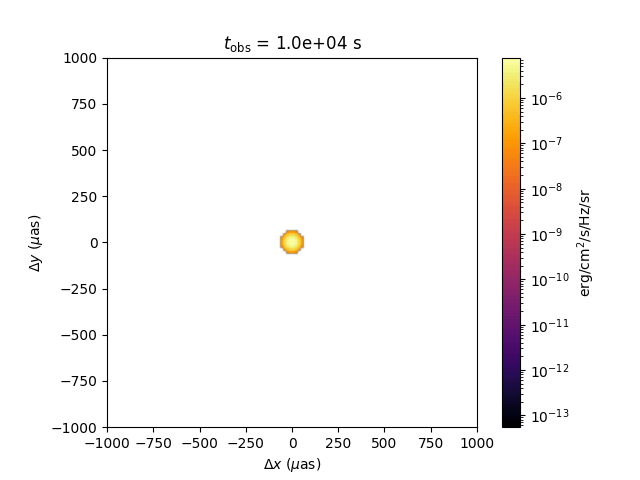

.. _sky-image:

Sky Image
=========

VegasAfterglow can generate spatially resolved images of the afterglow at any observer time and frequency. The ``sky_image()`` method uses Gaussian splatting to render each fluid element onto a 2D image plane. Batch evaluation is supported: pass an array of observer times to produce a multi-frame image sequence with minimal overhead (the blast-wave dynamics are solved once, and each frame only re-renders the sky projection).

Single Frame
------------

.. code-block:: python

    import numpy as np
    import matplotlib.pyplot as plt
    from matplotlib.colors import LogNorm
    from VegasAfterglow import TophatJet, ISM, Observer, Radiation, Model
    from VegasAfterglow.units import uas

    model = Model(
        jet=TophatJet(theta_c=0.1, E_iso=1e52, Gamma0=200),
        medium=ISM(n_ism=1),
        observer=Observer(lumi_dist=1e26, z=0.1, theta_obs=0),
        fwd_rad=Radiation(eps_e=1e-1, eps_B=1e-3, p=2.3),
    )

    img = model.sky_image([1e6], nu_obs=1e9, fov=500 * uas, npixel=128)

    fig, ax = plt.subplots(dpi=100)
    extent = img.extent / uas  # convert to microarcseconds

    im = ax.imshow(
        img.image[0].T,
        origin="lower",
        extent=extent,
        cmap="inferno",
        norm=LogNorm(),
    )
    ax.set_xlabel(r"$\Delta x$ ($\mu$as)")
    ax.set_ylabel(r"$\Delta y$ ($\mu$as)")
    ax.set_title(r"$t_{\rm obs} = 10^6$ s, $\nu = 1$ GHz")
    fig.colorbar(im, label=r"Surface brightness (erg/cm$^2$/s/Hz/sr)")
    plt.tight_layout()

.. figure:: /_static/images/sky_image_single.png
   :width: 500
   :align: center

   On-axis sky image at :math:`t_{\rm obs} = 10^6` s, :math:`\nu = 1` GHz. The limb-brightened ring is characteristic of relativistic blast waves viewed on-axis.

**Return value (``SkyImage`` object):**

- ``img.image``: 3D numpy array of shape ``(n_frames, npixel, npixel)`` — surface brightness in erg/cm²/s/Hz/sr
- ``img.extent``: 1D array ``[x_min, x_max, y_min, y_max]`` — angular extent in radians (pass directly to ``imshow(extent=...)``)
- ``img.pixel_solid_angle``: pixel solid angle in steradians

.. tip::
    The ``fov`` parameter sets the total field of view in radians. Use the ``uas`` unit constant
    for microarcsecond scale: ``fov=500*uas`` gives a 500 µas field of view.

Multi-Frame Movie
-----------------

Pass an array of observer times to generate an image sequence efficiently:

.. code-block:: python

    from matplotlib.animation import FuncAnimation
    from IPython.display import HTML

    times = np.logspace(4, 8, 60)  # 60 frames from 10^4 to 10^8 s

    imgs = model.sky_image(times, nu_obs=1e9, fov=2000 * uas, npixel=128)
    # imgs.image.shape == (60, 128, 128)

    extent = imgs.extent / uas

    vmin = imgs.image[imgs.image > 0].min()
    vmax = imgs.image.max()

    fig, ax = plt.subplots(dpi=100)
    im = ax.imshow(
        imgs.image[0].T,
        origin="lower",
        extent=extent,
        cmap="inferno",
        norm=LogNorm(vmin=vmin, vmax=vmax),
    )
    title = ax.set_title("")
    ax.set_xlabel(r"$\Delta x$ ($\mu$as)")
    ax.set_ylabel(r"$\Delta y$ ($\mu$as)")
    fig.colorbar(im, label=r"erg/cm$^2$/s/Hz/sr")

    def update(frame):
        im.set_data(imgs.image[frame].T)
        title.set_text(f"$t_{{\\rm obs}}$ = {times[frame]:.1e} s")
        return (im, title)

    anim = FuncAnimation(fig, update, frames=len(times), interval=100, blit=True)
    anim.save("sky-image.gif", writer="pillow", fps=10)

Off-Axis Observer
-----------------

For off-axis observers, the image centroid drifts across the sky (superluminal apparent motion):

.. code-block:: python

    model_offaxis = Model(
        jet=TophatJet(theta_c=0.1, E_iso=1e52, Gamma0=200),
        medium=ISM(n_ism=1),
        observer=Observer(lumi_dist=1e26, z=0.1, theta_obs=0.4),
        fwd_rad=Radiation(eps_e=1e-1, eps_B=1e-3, p=2.3),
    )

    times_oa = np.logspace(5, 8, 30)
    imgs_oa = model_offaxis.sky_image(times_oa, nu_obs=1e9, fov=5000 * uas, npixel=128)

.. figure:: /_static/images/sky_image_offaxis.png
   :width: 700
   :align: center

   Off-axis sky image evolution (:math:`\theta_{\rm obs} = 0.4` rad) at :math:`t = 10^5, 10^6, 10^7` s. The image centroid drifts across the sky (superluminal apparent motion) as the jet decelerates and the beaming cone widens.

Flux from Image vs Direct Calculation
---------------------------------------

The sky image contains surface brightness in erg/cm²/s/Hz/sr. Integrating over all pixels
(i.e. summing the image and multiplying by the pixel solid angle) recovers the total flux
density, which should match the result from ``flux_density_grid()``:

.. code-block:: python

    import numpy as np
    import matplotlib.pyplot as plt
    from VegasAfterglow import TophatJet, ISM, Observer, Radiation, Model
    from VegasAfterglow.units import uas

    model = Model(
        jet=TophatJet(theta_c=0.1, E_iso=1e52, Gamma0=200),
        medium=ISM(n_ism=1),
        observer=Observer(lumi_dist=1e26, z=0.1, theta_obs=0),
        fwd_rad=Radiation(eps_e=1e-1, eps_B=1e-3, p=2.3),
    )

    t_obs = np.logspace(3, 8, 30)
    nu_obs = 1e9

    # Method 1: integrate sky image
    img = model.sky_image(t_obs, nu_obs=nu_obs, fov=2000 * uas, npixel=128)
    flux_from_image = img.image.sum(axis=(1, 2)) * img.pixel_solid_angle

    # Method 2: direct flux density calculation
    flux_direct = model.flux_density_grid(t_obs, np.array([nu_obs])).total[0, :]

    # Plot comparison
    fig, (ax1, ax2) = plt.subplots(2, 1, figsize=(5, 5), dpi=150, sharex=True,
                                    gridspec_kw={"height_ratios": [3, 1], "hspace": 0.05})

    ax1.loglog(t_obs, flux_direct, "k-", label="flux_density_grid")
    ax1.loglog(t_obs, flux_from_image, "o", ms=4, color="C1", label="sky_image (integrated)")
    ax1.set_ylabel(r"Flux density (erg/cm$^2$/s/Hz)")
    ax1.legend()

    ratio = flux_from_image / flux_direct
    ax2.semilogx(t_obs, ratio, "o-", ms=4, color="C1")
    ax2.axhline(1, color="k", ls="--", lw=0.8)
    ax2.set_ylabel("image / direct")
    ax2.set_xlabel("Observer time (s)")
    ax2.set_ylim(0.95, 1.05)
    plt.tight_layout()

.. figure:: /_static/images/sky_image_flux_comparison.png
   :width: 500
   :align: center

   Comparison of flux density obtained by integrating the sky image (orange dots) versus the direct ``flux_density_grid()`` calculation (black line). The bottom panel shows the ratio, confirming agreement to within a few percent.

.. note::
    The two methods agree to within a few percent. Small differences arise because the image
    uses a finite field of view and pixel resolution. Increasing ``npixel`` and ``fov`` improves
    the agreement.

.. note::
    For a complete working example with animations and plots, see ``script/sky-image.ipynb``.
